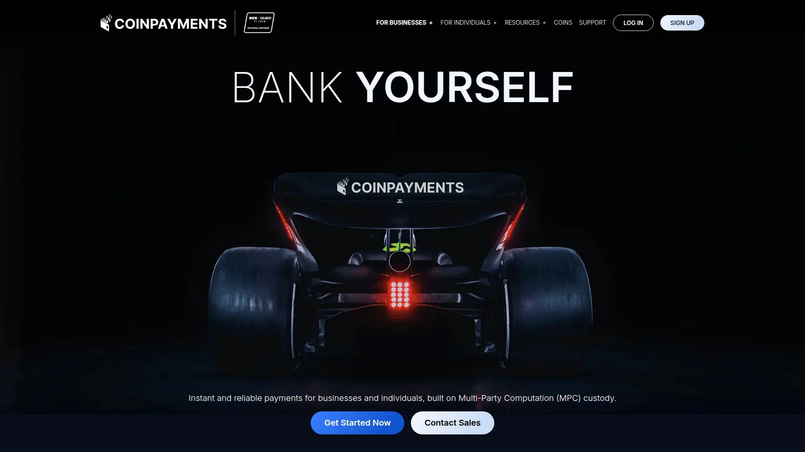

# Top 8 Cryptocurrency Payment Gateways Ranked in 2025 (Latest Update)

Accepting traditional payments locks you into expensive transaction fees, chargeback headaches, and geographic restrictions that keep global customers away. Cryptocurrency payment gateways eliminate these barriers by enabling instant blockchain transactions with minimal processing costs, no chargebacks, and true worldwide accessibility for any business accepting digital currency. Whether launching an e-commerce store, running a subscription service, or operating retail locations, the right crypto payment processor converts volatile digital assets into stable fiat currency automatically while expanding your customer base to over 420 million cryptocurrency holders globally.

***

## **[CoinPayments](https://coinpayments.net)**

Global cryptocurrency wallet supporting 1,340+ coins with instant confirmations and multicurrency storage.

CoinPayments processes blockchain payments across the broadest cryptocurrency selection available, handling everything from Bitcoin and Ethereum to hundreds of altcoins and tokens most competitors ignore. The platform serves as both payment processor and multicurrency wallet, storing received funds directly in your online account before transferring to cold storage.

**GAP600 Integration for Speed**

The GAP600 instant confirmation technology analyzes incoming transactions with live risk scoring engines that evaluate double-spend risks in real time. This breakthrough enables over 85% of transactions to complete instantly without waiting for network confirmations, solving the historically slow checkout experience cryptocurrency payments suffered from. Customers complete purchases immediately while merchants receive guaranteed payment protection.

Point-of-sale functionality generates QR codes and payment addresses for in-person retail environments. Simply bookmark your POS checkout URL, input the purchase amount, select accepted cryptocurrency, and present the generated code for customer scanning. The system works identically online through shopping cart plugins integrating with WooCommerce, BigCommerce, and major e-commerce platforms.

API-first architecture allows developers to build custom payment workflows, automate wallet management, and handle complex transaction routing without blockchain expertise. Payment forwarding automatically sends received cryptocurrency to specified addresses, while built-in conversion exchanges accepted coins into your preferred cryptocurrency. Multi-party computation enhances custodial wallet security beyond standard encryption.

The XRP Ledger integration leverages near-instant settlement with minimal fees, particularly beneficial for high-volume merchants processing hundreds of daily transactions. Custom checkout buttons and invoice generation provide flexible implementation options matching your specific use case.

***

## **[BitPay](https://bitpay.com)**

Established crypto processor converting 100+ digital currencies into local fiat with next-day bank settlement.

BitPay operates as the longest-running cryptocurrency payment service provider, founded 2011 with peak processing volumes exceeding $1 billion annually. The platform converts Bitcoin, Bitcoin Cash, Ethereum, and 100+ leading cryptocurrencies into over 150 conventional central-bank currencies without exposing merchants to price volatility.

**Four-Step Settlement Process**

BitPay displays the invoice to customers with locked exchange rates preventing price fluctuation during checkout. Customers pay using their preferred wallet by scanning QR codes on desktop or mobile devices. BitPay converts received cryptocurrency into your local currency automatically at the locked rate. Bank settlement transfers initiate the next business day, depositing fiat currency directly to your account.

Zero chargeback risk eliminates fraud losses traditional payment processors force merchants to absorb. No identity fraud exposure protects customer privacy while maintaining transaction security. Ninety-three percent of retailers supporting crypto report positive business impact according to Deloitte research.

The retail point-of-sale system accepts Bitcoin and Bitcoin Cash at physical locations with terminal hardware or web-based interfaces. Email billing creates and sends invoices to clients settling in preferred currencies. WooCommerce, Shopify, and additional e-commerce integrations embed checkout functionality without custom development.

BitPay wallet app provides customers secure storage, swap capabilities, and spending options creating circular ecosystem encouraging adoption. Worldwide coverage operates in most countries globally, supported by established regulatory compliance.

***

## **[Coinbase Commerce](https://coinbase.com/commerce)**

Direct cryptocurrency acceptance backed by Coinbase exchange reputation with customizable merchant dashboard.

Coinbase Commerce leverages parent company Coinbase's position as one of the largest regulated cryptocurrency exchanges globally. The service enables direct crypto-to-crypto payments where merchants maintain full custody over received funds rather than relying on intermediary processors.

Major cryptocurrencies including Bitcoin, Ethereum, Litecoin, Bitcoin Cash, USDC, DAI, and additional stablecoins receive support. Automatic USDC conversion minimizes volatility exposure by converting received payments into dollar-pegged stablecoins immediately. This stabilizes revenue without complete fiat conversion.

**Integration Simplicity**

Platform integrates seamlessly with Shopify, WooCommerce, Magento, and Jumpseller through pre-built plugins requiring minimal technical knowledge. The customizable API accommodates businesses running custom websites or unique checkout workflows. Checkout experience adapts to match your brand identity, maintaining consistent user experience.

Real-time transaction monitoring tracks payments, manages invoices, and displays status updates through the merchant dashboard. Two-factor authentication via Google Authenticator adds security layers protecting account access. Customers pay using any compatible wallet, though Coinbase wallet users experience streamlined transfers.

Coinbase Commerce charges 1% transaction fees for cryptocurrency processing with no setup costs or subscription requirements. Network processing fees paid to blockchain validators apply separately based on cryptocurrency and transaction size. Converting to fiat currencies through Coinbase exchange may incur additional exchange fees. The service works best for online sellers, freelancers, and small businesses with affordable products and minimal overhead.

***

## **[NOWPayments](https://nowpayments.io)**

Non-custodial gateway supporting 300+ cryptocurrencies with automatic fiat conversion and donation widgets.

NOWPayments founded 2019 by the ChangeNOW cryptocurrency exchange team operates as non-custodial service meaning it never holds or stores merchant funds. This architecture eliminates counterparty risk and maintains true cryptocurrency ownership throughout transactions.

Over 300 supported coins and tokens cover Bitcoin, Ethereum, stablecoins like USDT and USDC, plus hundreds of altcoins competitors ignore. Currency flexibility allows accepting any cryptocurrency while automatically converting to your preferred coin through integrated ChangeNOW exchange. Customers pay with their holdings while you receive desired cryptocurrency.

**Automatic Fiat Conversion**

Real-time fiat conversion protects businesses from market volatility by transforming cryptocurrency into traditional currency automatically. You receive payment in your preferred currency regardless of what crypto customers use. This eliminates manual conversion steps and reduces volatility exposure.

Integration options span API, plugins, invoices, and donation buttons with HTML code snippets requiring simple copy-paste implementation. E-commerce plugins support Magento 2, OpenCart, WooCommerce, WHMCS, Zen Cart, PrestaShop, Ecwid, and additional platforms. Donation widgets enable charities and content creators to accept cryptocurrency fundraising without payment amounts specified upfront.

Comprehensive analytics track payments with detailed transaction insights and reporting tools monitoring business performance. The platform launched 2019 specifically targeting e-commerce shops, SaaS platforms, gaming companies, content creators, and nonprofits requiring versatile payment solutions. Transactions tie to NOWPayments accounts through API keys managing different implementation purposes.

***

## **[TripleA](https://triple-a.io)**

Licensed payment institution offering crypto acceptance, payouts, and rewards across US, Europe, and Singapore jurisdictions.

TripleA operates as global payment institution licensed in United States through FinCEN, Europe via France's ACPR, and Singapore under MAS regulation. This multi-jurisdiction licensing demonstrates regulatory compliance meeting international standards. Partnership with Visa Accelerator Program strengthens credibility and integration capabilities.

Major cryptocurrencies supported include Bitcoin, Lightning Bitcoin, Ethereum, USDC, and USDT. Lightning Network integration dramatically reduces Bitcoin transaction fees and confirmation times compared to on-chain settlements. Over 20,000 businesses worldwide trust TripleA for processing cryptocurrency payments.

**Three Core Services**

Crypto acceptance enables customers to pay directly with digital currencies, expanding revenue by accessing 420+ million cryptocurrency user spending power. Locked exchange rates prevent price fluctuation during checkout, while instant confirmations eliminate waiting. Chargeback protection and white-label customization options appeal to enterprises requiring branded experiences.

Crypto payouts facilitate cost-efficient cross-border payments to suppliers, merchants, employees, and freelancers globally in digital currencies. 24/7 real-time settlement operates continuously without banking hour restrictions. API integration automates payment distribution workflows.

Crypto rewards programs implement cashback in cryptocurrency for end users building loyalty without customers directly purchasing crypto. This passive earning approach attracts consumers interested in accumulating digital assets without individual investment risk.

T+1 settlement in selected local currencies transfers funds to bank accounts within one business day. Compatible with all cryptocurrency wallets ensuring customers use their preferred storage solutions. Know Your Business verification processes require completion before bank settlements begin.

***

## **[CoinGate](https://coingate.com)**

Merchant-focused gateway providing flexible withdrawals, refunds, mass payouts, and real-time order tracking.

CoinGate specializes in merchant solutions with robust dashboard managing payment activities efficiently. The platform serves merchants across industries seeking to accept Bitcoin, stablecoins, and alternative cryptocurrencies through single unified account.

Four-step transaction flow presents detailed invoices to customers showing payment amounts and cryptocurrency addresses. Customers pay at fixed exchange rates protecting both parties from price movement during checkout. CoinGate transforms received cryptocurrency into merchant's preferred currency automatically. On-demand withdrawals transfer funds to crypto wallets or bank accounts when requested.

**Team Management Features**

Permission systems assign specific access levels to team members managing company accounts collaboratively. Comprehensive payment activity reports download for accounting and analysis purposes. Real-time order tracking with notifications ensures merchants stay informed about transaction status. In-house currency converter exchanges cryptocurrencies within account balances automatically or manually.

Cryptocurrency refunds process in various digital currencies without complications. Mass payouts send bulk payments to hundreds of customers and business partners simultaneously, ideal for content creators paying contributors or marketplaces distributing seller earnings.

CoinGate charges flat 1% fees for processed paid orders with no setup costs or subscription requirements. Euro payouts to bank accounts, AdvCash, or Skrill wallets avoid cryptocurrency volatility completely. Alternatively, merchants receive Bitcoin payouts directly to their wallets maintaining exposure to price appreciation.

The platform supports purchasing cryptocurrencies through SEPA transfers, direct bank transfers, credit cards, mobile balance, Skrill, Neteller, and QQPay across different global regions. Selling capabilities allow converting cryptocurrency holdings to fiat through multiple methods.

***

## **[Coinify](https://coinify.com)**

European crypto payment gateway with plug-and-play API supporting 20+ digital currencies across 180+ countries.

Coinify founded 2014 with backing from SEED Capital Denmark, SEB Venture Capital, and Accelerace operates as established virtual currency platform. Danish Financial Supervisory Authority regulation ensures compliance with EU standards. The company serves businesses across Europe, Asia, and additional regions globally.

Over 20 cryptocurrencies receive support including Bitcoin, Ethereum, Bitcoin Cash, and popular altcoins. This selection accommodates wide customer preferences while maintaining manageable complexity. Payments process quickly with near-instant settlement to merchant bank accounts.

**Merchant Implementation Options**

Customizable invoices, merchant dashboard, and point-of-sale systems provide retail transaction capabilities. Direct bank transfer integration and e-commerce platform connections simplify existing system adoption. Shopify and WooCommerce plugins enable one-click installation for popular platforms.

Crypto-to-fiat automatic conversions occur upon payment confirmation with daily deposits into merchant bank accounts. This eliminates manual exchange steps and volatility monitoring. Transaction fees of 1% include conversion and processing costs. Additional payout fees of €1 for SEPA transfers and €5 for international wires apply when moving funds to banks.

Two-factor authentication, end-to-end encryption, and cold storage protect cryptocurrency holdings. The platform operates under rigorous EU regulations providing transparency and security assurances. Availability spans 180+ countries enabling truly global commerce.

Plug-and-play API design ensures seamless integration with settlement options in both cryptocurrency and cash. Featured customers include financial services companies, luxury goods retailers, and technology firms across industries.

***

## **[BTCPay Server](https://btcpayserver.org)**

Free open-source Bitcoin payment processor with self-hosted deployment and zero transaction fees.

BTCPay Server represents fundamentally different architecture as completely free, open-source, self-hosted solution with no intermediaries or processing fees beyond standard Bitcoin network costs. This aligns with Bitcoin community ethos emphasizing decentralization and sovereignty.

**Core Advantages**

Direct peer-to-peer payments flow from customers straight to merchant wallets without third-party involvement. No arbitrary merchant processing fees apply whatsoever. Zero middleman architecture eliminates counterparty risk entirely. No Know Your Customer requirements preserve privacy for both merchants and customers. Non-custodial design grants total control over private keys.

Self-hosted deployment requires technical capability running server infrastructure but delivers enhanced privacy and security impossible with hosted solutions. Third-party hosting options exist for merchants preferring simpler setup. Integration plugins connect to WooCommerce, Shopify, PrestaShop, Magento, Drupal, Shopware, and additional e-commerce platforms.

Automated invoicing system generates payment requests displaying QR codes customers scan with Bitcoin wallets. Blockchain tracking monitors payments with confirmation notifications triggering order fulfillment. Refund handling and bitcoin management features maintain smooth transaction processes.

Point-of-sale app runs on any web-connected device enabling in-person retail payments. Payment requests facilitate bill pay services, freelancer invoicing, and casual money requests between individuals. Lightning Network support enables instant microtransactions with minimal fees through payment channel technology.

The platform exclusively supports Bitcoin and select altcoins rather than broad cryptocurrency selection. Lack of automatic fiat settlement means merchants maintain Bitcoin exposure and handle conversion separately if desired. This proves advantageous for Bitcoin believers but challenging for businesses sensitive to price fluctuations.

***

## FAQ

**How do crypto payment gateways protect merchants from cryptocurrency price volatility?**

Most crypto payment processors offer automatic conversion services that lock exchange rates at checkout and immediately convert received cryptocurrency into fiat currency or stablecoins like USDC. Platforms like BitPay, Coinbase Commerce, and TripleA settle payments in your local currency within 1-2 business days, eliminating exposure to price swings. This allows accepting cryptocurrency benefits while maintaining stable revenue predictability identical to traditional payment processing.

**What transaction fees should I expect when accepting cryptocurrency payments?**

Cryptocurrency payment gateways typically charge 1% flat transaction fees significantly lower than credit card processing rates of 2.9% plus fixed fees. CoinGate, Coinbase Commerce, and Coinify all charge approximately 1% with no monthly subscriptions or setup costs. BTCPay Server charges zero processor fees, though Bitcoin network fees still apply. Traditional payment processors also charge chargeback fees and PCI compliance costs that cryptocurrency completely eliminates, further reducing total payment processing expenses.

**Can I accept cryptocurrency payments without holding crypto assets directly?**

Absolutely—most cryptocurrency payment gateways automatically convert received digital currency into your preferred fiat currency before settlement. BitPay, TripleA, and CoinGate all offer instant conversion services depositing local currency to your bank account the next business day. Merchants never need cryptocurrency wallets, blockchain knowledge, or direct crypto exposure. This approach captures cryptocurrency market opportunities while maintaining traditional business accounting and zero volatility risk.

***

## Conclusion

Cryptocurrency payment gateways unlock global markets, eliminate costly chargebacks, and reduce transaction fees substantially compared to traditional processors while maintaining familiar settlement workflows through automatic fiat conversion. Each platform balances different priorities—some emphasize broad cryptocurrency support, others focus on regulatory compliance, and alternatives prioritize zero-fee self-hosted infrastructure. **[CoinPayments](https://coinpayments.net)** excels for merchants requiring the widest cryptocurrency selection available, making it particularly suitable for businesses serving tech-savvy international customers who hold diverse digital asset portfolios beyond mainstream Bitcoin and Ethereum. The platform's 1,340+ supported coins combined with GAP600 instant confirmations and integrated multicurrency wallet eliminate adoption barriers while maintaining professional checkout experiences. Evaluate your specific requirements around supported cryptocurrencies, desired settlement currency, technical expertise, and geographic markets, then test platforms using their demo environments to confirm transaction flows match your operational needs before committing to implementation.
